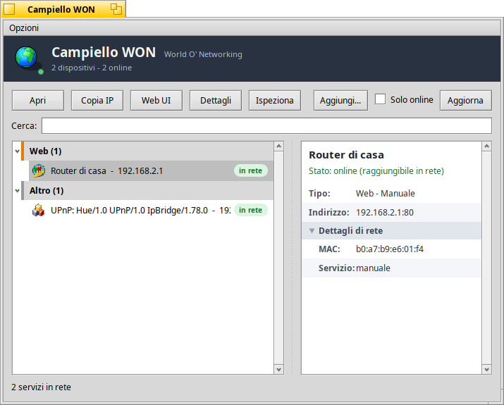

# Campiello

A modern, native, MIT-licensed successor to World O' Networking for Haiku.

Campiello makes other machines on your LAN appear as browsable folders inside
Tracker, with no Samba, no config, and no visible keys or certificates. Two modes,
one browser:

- **Interop mode** mounts remote shares from the rest of the world (SFTP now, plus
  Windows/SMB via the optional add-on; WebDAV/NFS4 later) so Haiku talks to Windows,
  Linux, macOS, and NAS boxes.
- **Native mode** is a Campiello-to-Campiello protocol with full BFS attribute
  fidelity and distributed live queries, things no SMB or NFS stack can carry.

Three non-negotiable principles: install in a double click, first use at zero
configuration, and security that is strong under the hood but invisible on the
surface (only ever a one-tap "allow this computer" prompt).



## Status

Working, under active development. The core package (`campiello`) ships:

- **Interop SFTP** - the `campiello_mount` connect helper + `campiello_sftp`
  userlandfs add-on mount a remote SFTP host as a read-only disk.
- **Native Campiello** - the resident `campiello_daemon` advertises and serves your
  shared folder over mutual-TLS CNP; the `campiello_net` add-on shows discovered
  peers as a `/Campiello` volume; a Deskbar replicant shows peer presence.
- **WON** (World O' Networking, a homage to the BeOS network browser; codename
  Vicinato) - a network-neighborhood app that lists every service found on the LAN
  (Windows shares, Campiello peers, computers, printers, media devices) grouped by
  kind, with a per-device icon. It shows live online/offline status (TCP plus ARP
  reachability), enriches each device with manufacturer, MAC, NetBIOS name and
  SSDP/UPnP discovery, and offers one-click actions: open, web UI, SSH terminal,
  RDP, Wake-on-LAN, and a collapsible details panel. An "Opzioni" menu toggles
  whether the window opens at login.
- **Distributed live query** - the headline native feature: a query predicate fans
  out to every peer, the results appear in a virtual `/.query/<predicate>` folder,
  and matches update live as files change on the peers (BQuery on the server pushed
  over the connection to the client). No SMB or NFS stack carries this.
- **Device add-ons** - an optional suite that turns a discovered device into a real
  action (Philips Hue, Chromecast, printers/scanners, and more).
- **Radar** - an mDNS/DNS-SD debug window that decodes what is on the network.

The optional `campiello_smb` package adds Windows/SMB shares (libsmb2, LGPL, kept
out of the MIT core). Mounting a userlandfs volume must be exercised in a throwaway
VM (an unmount hazard, see `docs/VERIFIED.md`).

## Build & install

The whole project builds and tests from the repo root with one command:

```
make            # build and run every unit-test suite (same as `make check`)
make packages   # build the core and optional .hpkg packages
make all        # check + packages
make apps       # build the Haiku GUI apps (radar, vicinato) for quick dev
make clean      # clean every subdirectory
```

Each subdirectory keeps its own Makefile; the root one drives them. The portable
suites run anywhere (Linux CI too); the Haiku GUI/FUSE pieces build on Haiku.

To install on Haiku:

```
make packages
pkgman install ./packaging/campiello-<version>-x86_64.hpkg
pkgman install ./packaging/smb/campiello_smb-<version>-x86_64.hpkg   # optional, for Windows shares
```

The optional SMB package needs a fixed `libsmb2` (the stock HaikuPorts build has a
Haiku errno bug in its connect path; the fix is in `docs/SMB.md`).

## Documentation

- `CONTRIBUTING.md` - conventions and guardrails for working on the project.
- `docs/PROPOSAL.md` - the full design document and driving context.
- `docs/PROTOCOL.md` - the Campiello Native Protocol (CNP) wire spec, kept authoritative.
- `docs/VERIFIED.md` - facts checked against the Haiku source, kept authoritative.
- `docs/NEIGHBORHOOD.md` - the WON network-neighborhood app and its actions.
- `docs/NETINTEL.md` - the LAN enrichment module (vendor/MAC, NetBIOS, SSDP, Wake-on-LAN).
- `docs/ICONS.md` - the per-service device icon set and its sources.
- `docs/REUSE.md` - what was harvested from existing Haiku projects and what is greenfield.

## Architecture

Three replaceable layers (Venetian working names):

- **Fondamenta** - the userlandfs add-on that presents peers as mountable volumes
  in Tracker (libfuse 2.x high-level API).
- **Traghetto** - the native transport and protocol (CNP), TLS 1.3 over TCP.
- **Bricola** - the discovery daemon, advertising and browsing `_campiello._tcp`
  over mDNS/DNS-SD, feeding a Deskbar replicant.
- **WON / Vicinato** (`src/vicinato/`) - the network-neighborhood app (user-facing
  name WON, World O' Networking), built on Bricola discovery and the Fondamenta
  backends (see `docs/NEIGHBORHOOD.md`).
- **Bossolo** (optional, later) - BMessage transfer over the LAN on the same plumbing.

See `docs/PROPOSAL.md` for the full picture.

## License

MIT. Core code and anything statically linked into it must be permissive (MIT, BSD,
Apache-2.0, ISC, zlib, public domain). GPL/LGPL code lives only under `optional/`,
dynamically loaded, off in the default build. See `docs/PROPOSAL.md` section 5.
